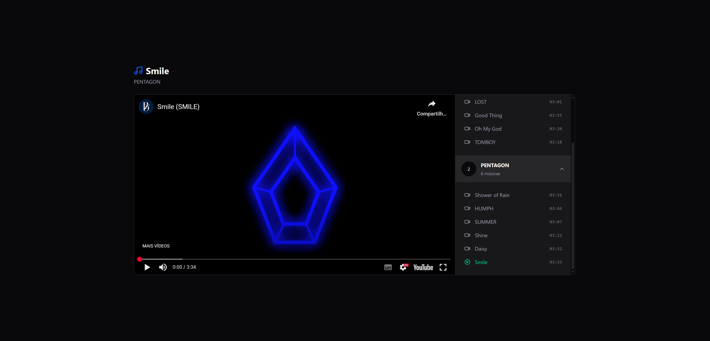

## Player de Vídeos
Player de Vídeos com Intgração do Youtube, com Zustand e Redux

<h1 align="center">
  
</h1>

<br /><br />

## 🚀 Tecnologias
- [TypeScript](https://www.typescriptlang.org/) > Linguagem Principal da Aplicação
- [React](https://react.dev/) > Framework da Aplicação 
- [Vite](https://vite.dev/) > Build Tool da Aplicação 
- [TailwindCSS](https://tailwindcss.com/) > Extensão para o NextJS para estilização das páginas
- [Lucide React](https://lucide.dev/) > Biblioteca de ícones
- [Axios](https://axios-http.com/ptbr/docs/intro) > Biblioteca HTTP para requisições à API
- [Redux](https://redux.js.org/) > Biblioteca de Gerenciamento de Estados
- [Zustand](https://zustand-demo.pmnd.rs/) > Biblioteca de Gerenciamento de Estados


<br /><br />

## 💻 Executando o Projeto


#### 1º Passo - Configure as Ferramentas necessárias para rodar o projeto:

- [Node.js](https://nodejs.org/en/) (Versão 22)


#### 2º Passo - Instale as Dependências:

```bash
$ npm install
```

#### 3º Passo - Rode o frontend e o server:

```bash
# Frontend
$ npm run dev

# Server
$ npm run server
```

<br /><br />

## Link do Deploy
https://player-musics-rdzs.vercel.app/
